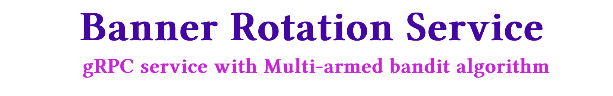
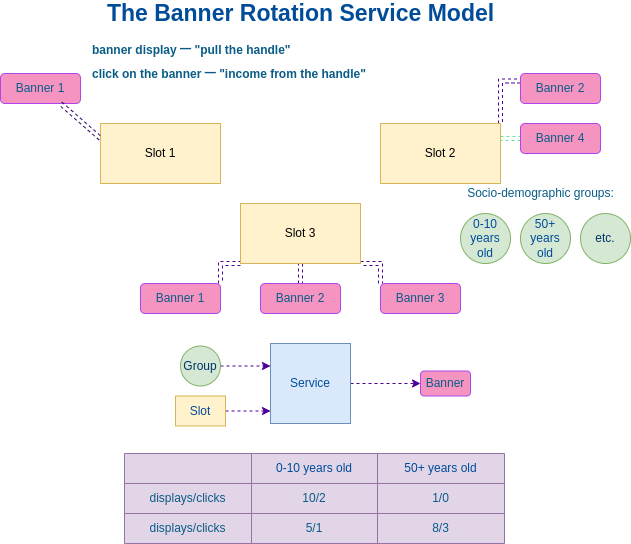

<p align="center">
</p>

<h2 align="center">

 [](https://goreportcard.com/report/github.com/Feride3d/banner-rotation-service) [](https://codeclimate.com/github/Feride3d/banners-rotation-service/test_coverage)

## About The Project
________
Service implemented on Go.
The Banner Rotation Service helps you to select the most clickable banners, in terms of changing socio-demographic groups of users and sets of banners. In other words, it is designed to stand out on a webpage and catch the consumer's eye.
The service rotates banners and displays those that are most likely to bring the click from one or another socio-demographic group of users. The service uses the ["Multi-armed bandit" algorithm](https://en.wikipedia.org/wiki/Multi-armed_bandit).

What are multi-armed bandits?
MAB is a type of A/B testing that uses machine learning to learn from data gathered during the test to dynamically increase the visitor allocation in favor of better-performing variations. More information about MAB you can find [here (in Russian)](https://habr.com/ru/company/surfingbird/blog/168611/) and [here (in English)](https://vwo.com/blog/multi-armed-bandit-algorithm/#:~:text=MAB%20is%20a%20type%20of,less%20traffic%20allocation%20over%20time.). 

<p align="center">


<p align="center">
</p>


## Architecture
______
The service consists of an API, a database and a queue. The service provides GRPC.

## Used Technologies and protocols
__________
        • Docker
        • gRPC Gateway (protocol buffers)
        • HTTP
        • PostgreSQL
        • RabbitMQ

## Commands (if you want to run the program)
__________
### Run the service (start docker containers):
```
make run 
```

### Down the service (stop docker containers):
```
make down 
```

### Build the service:
```
make up
```

### Lint the service with golangci-lint:
```
make lint 
```

### Test the service (unit tests):
```
make test
```

### Generate proto files:
```
make proto
```

### Generate gRPC Gateway:
```
make generate-gateway
```

### Run migration:
```
make migration-up
```

### Down migration:
```
make migration-down
```

## Examples of requests
___________
Now you can try use API for making requests (for example): 

### CreateBanner
* Method: POST
* Request: api/banners/create

### CreateSlot
* Method: POST
* Request: api/slots/create

### CreateGroup
* Method: POST
* Request: api/groups/create

### AddBanner
* Method: POST
* Request: api/banners/add

### DeleteBanner
* Method: POST
* Request: api/banners/delete

### AddClick
* Method: POST
* Request: api/banners/click

### AddBannerDisplay
* Method: POST
* Request: api/banners/get


## Description of items
_________
### Banner
Banner - an advertising/informational element that is displayed in the Slot.
* ID
* Description

One banner can participate in the rotation in several slots.
Banner statistics are stored within one slot.

### Slot
Slot - the place on the site, where we display banners.
* ID
* Description

### Group
Group is a social dem.  group of site users with similar interests,
for example "girls 20-25" or "grandfathers 80+".
* ID
* Description

## Description of methods (requests to the server)
_______

### AddBanner
Adds a new banner to the rotation in this slot.
* Banner ID
* Slot ID

### DeleteBanner
Deletes a banner from the rotation in this slot.
* Slot ID
* Banner ID

### NewClick
Increases the click count by 1 for the specified banner in this slot in the specified group.
* Slot ID
* Banner ID
* Group ID

### AddBannerDisplay
Selects a banner to display. Returns the banner to be shown at the moment in the specified slot for the specified social dem. groups. Increases the number of banner displays in the group.

Takes:
* Slot ID
* Group ID

Returns:
* Banner ID
  
## Statistics
________
Service sends click and impression events to a rabbitMQ (queue of messages (events)) for further processing in analytical systems.

The event format is as follows:
* Type: click or display
* Slot ID
* Banner ID
* Group ID
* Date and time
  
## Deployment
________
The microservice is deployed using the `make run` command (inside `docker compose up`) in the project directory.

## License
_________
All source code is licensed under the [MIT License](https://choosealicense.com/licenses/mit/).

Technical specification and its authors уou can find [here](https://github.com/OtusGolang/final_project/blob/master/README.md).